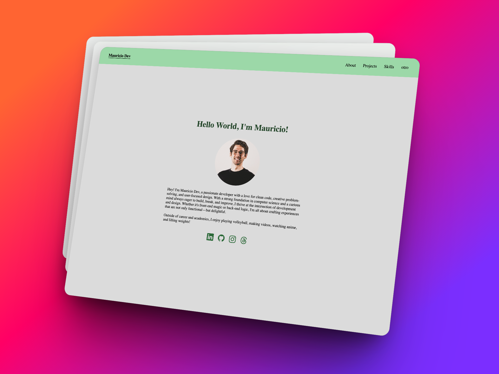

# Portfolio Template

Plantilla de portfolio sólo con HTML y CSS.



## Descripción

Para usar esta platilla de portfolio puedes clonar por diferentes formas:

1. HTTPS:
   ```sh
   git clone https://github.com/VlassDev/portfolio-template.git
   ```
2. SSH
   ```sh
   git@github.com:VlassDev/portfolio-template.git
   ```
3. GitHub CLI
   ```sh
   gh repo clone VlassDev/portfolio-template
   ```

## Atención!

El responsive de esta página web está en proceso...

## Licencia

Código abierto: "Puedes clonar este proyecto y modificarlo para tu uso"
